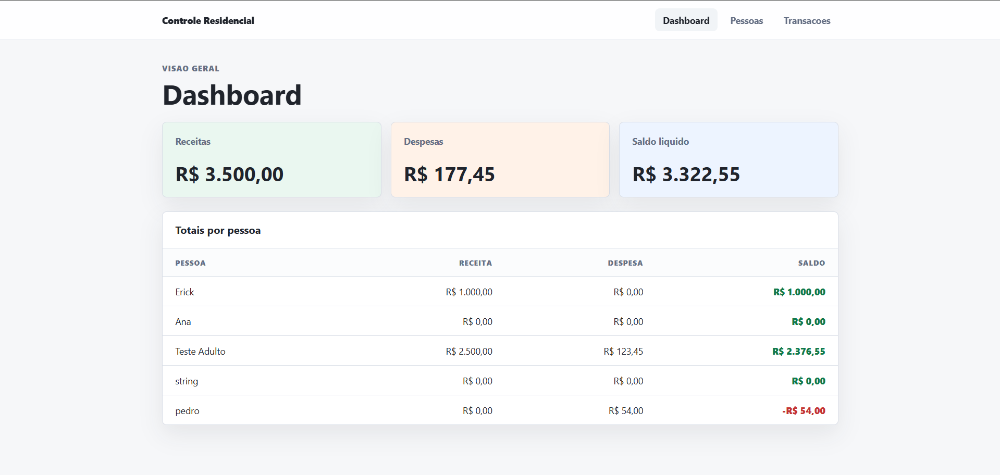
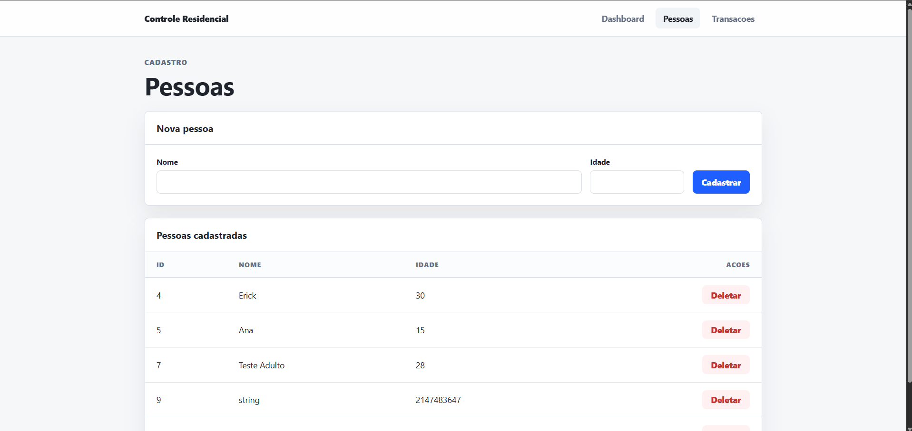
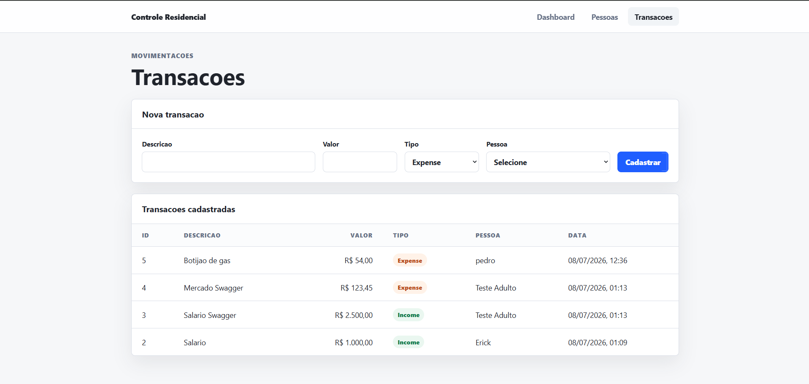

# Gerenciador de despesas domésticas

Sistema Full Stack para controle de gastos residenciais, desenvolvido utilizando **ASP.NET Core Web API** no back-end e **React + TypeScript** no front-end.

A aplicação permite o gerenciamento de pessoas, cadastro de transações financeiras (receitas e despesas) e consulta de resumos financeiros individuais e gerais, seguindo todas as regras de negócio propostas no desafio técnico.

---

#  Funcionalidades

##  Cadastro de Pessoas

- Cadastro de pessoas
- Listagem de pessoas cadastradas
- Exclusão de pessoas
- Exclusão automática das transações relacionadas quando uma pessoa é removida

Cada pessoa possui:

- Identificador único
- Nome
- Idade

---

##  Cadastro de Transações

Permite:

- Cadastro de receitas
- Cadastro de despesas
- Listagem de transações

Cada transação possui:

- Identificador único
- Descrição
- Valor
- Tipo (Receita ou Despesa)
- Pessoa vinculada

---

##  Consulta de Totais

O sistema calcula automaticamente:

Para cada pessoa:

- Total de receitas
- Total de despesas
- Saldo

Também apresenta o resumo geral contendo:

- Total geral de receitas
- Total geral de despesas
- Saldo líquido

---

#  Regras de Negócio

O sistema implementa as seguintes regras:

- Toda pessoa possui um identificador gerado automaticamente.
- Toda transação deve estar vinculada a uma pessoa cadastrada.
- Pessoas menores de 18 anos podem cadastrar apenas despesas.
- Ao excluir uma pessoa, todas as suas transações também são removidas.
- O resumo financeiro é calculado dinamicamente com base nas transações cadastradas.

---

#  Tecnologias Utilizadas

## Back-end

- ASP.NET Core Web API
- C#
- Entity Framework Core
- SQLite
- Swagger / OpenAPI

## Front-end

- React
- TypeScript
- Vite
- Axios
- React Router DOM

---

#  Estrutura do Projeto

```text
household-expense-manager
│
├── backend
│   └── HouseholdExpenseManager.Api
│
├── frontend
│
└── README.md
```

---

#  Arquitetura

O projeto foi desenvolvido utilizando uma arquitetura em camadas, separando responsabilidades entre apresentação, regras de negócio e acesso aos dados.

```text
Controllers
      │
      ▼
Services
      │
      ▼
Repositories
      │
      ▼
Entity Framework Core
      │
      ▼
SQLite
```

Essa organização facilita a manutenção, escalabilidade e legibilidade do código.

---

#  Como Executar o Projeto

## Pré-requisitos

- .NET SDK 9 ou superior
- Node.js 20 ou superior
- npm

---

## 1. Clonar o repositório

```bash
git clone https://github.com/erickdsr/household-expense-manager.git
```

Entre na pasta do projeto:

```bash
cd household-expense-manager
```

---

#  Executando o Back-end

Entre na pasta:

```bash
cd backend/HouseholdExpenseManager.Api
```

Restaure as dependências:

```bash
dotnet restore
```

Execute a aplicação:

```bash
dotnet run
```

A API ficará disponível em:

```
https://localhost:5001
```

Documentação Swagger:

```
https://localhost:5001/swagger
```

---

#  Executando o Front-end

Abra outro terminal.

Entre na pasta:

```bash
cd frontend
```

Instale as dependências:

```bash
npm install
```

Execute:

```bash
npm run dev
```

A aplicação ficará disponível em:

```
http://localhost:5173
```

---

#  Endpoints da API

## Pessoas

| Método | Endpoint |
|---------|----------|
| GET | /api/people |
| POST | /api/people |
| DELETE | /api/people/{id} |

---

## Transações

| Método | Endpoint |
|---------|----------|
| GET | /api/transactions |
| POST | /api/transactions |

---

## Resumo Financeiro

| Método | Endpoint |
|---------|----------|
| GET | /api/summary |

---

#  Persistência

Os dados são armazenados utilizando **SQLite**, garantindo que permaneçam disponíveis mesmo após o encerramento da aplicação.

Arquivo do banco:

```
household_expenses.db
```

---

#  Validações Implementadas

O sistema realiza validações tanto no front-end quanto no back-end.

Entre elas:

- Nome obrigatório
- Idade obrigatória
- Idade não pode ser negativa
- Valor da transação deve ser maior que zero
- Pessoa deve existir
- Menores de idade não podem cadastrar receitas
- Exclusão automática das transações ao remover uma pessoa

As regras de negócio são validadas principalmente no back-end.

---

#  Tratamento de Erros

A API retorna mensagens padronizadas para facilitar o tratamento pelo front-end.

Exemplo:

```json
{
    "success": false,
    "message": "Pessoas menores de idade podem cadastrar apenas despesas."
}
```

---

#  Demonstração

### Dashboard

<p align="center">
  
</p>

---

### Cadastro de Pessoas

<p align="center">
  
</p>

---

### Cadastro de Transações

<p align="center">
  
</p>

---

#  Autor

**Francisco Erick de Sousa Rodrigues**

Desenvolvedor Full Stack

- GitHub: https://github.com/erickdsr
- LinkedIn: https://www.linkedin.com/in/erickdsr
